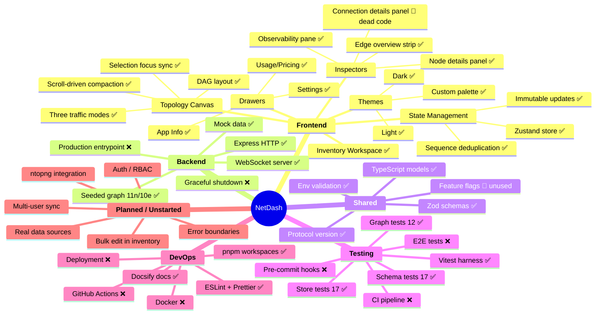

# NetDash — Project Scope Map

> **Purpose:** Single source of truth for project scope, status, and assumptions.  
> Renders visually on GitHub and in VS Code (Mermaid extension).  
> Update this file as scope evolves.

---

## Mindmap

---

## Status Legend

| Symbol | Meaning |
|--------|---------|
| ✅ | Done and working |
| 🔸 | Exists but has issues (dead code, unused, incomplete) |
| ❌ | Not started |

---

## Key Assumptions

| # | Assumption | Confidence |
|---|---|---|
| 1 | The app targets a single homelab operator (no multi-tenancy yet) | High |
| 2 | All data is mock — no real device polling or agent integration exists | High |
| 3 | WebSocket is the only data transport (no REST API for graph data) | High |
| 4 | The topology is static (backend defines it); frontend cannot mutate | High |
| 5 | Node count stays small (<50) — no virtualization or clustering needed yet | Medium |
| 6 | The project will eventually connect to real sources (ntopng, Unifi, Proxmox) | Medium |
| 7 | Feature flags exist to gate future features but nothing consumes them yet | High |
| 8 | No auth is needed during prototype phase | High |

---

## Decision Log

| Date | Decision | Rationale |
|------|----------|-----------|
| 2025-xx | Zustand over Redux | Simpler API, less boilerplate for this scale |
| 2025-xx | Zod for runtime validation | Shared schemas between FE/BE, discriminated unions |
| 2025-xx | ReactFlow for canvas | Mature, handles pan/zoom/edges, custom nodes |
| 2025-xx | Dagre for layout | Deterministic LR DAG, no manual positioning |
| 2025-xx | pnpm workspaces | Fast, strict, good monorepo support |
| 2026-05-16 | Vitest for testing | Fast ESM-native runner, workspace-level config |

---

## Next Priorities (suggested)

1. Wire tests into CI (GitHub Actions) or pre-commit (husky)
2. Add React error boundary around canvas + observability
3. Memoize DAG layout for performance
4. Remove or wire up `ConnectionDetailsPanel` (currently dead)
5. Add graceful shutdown + production `start` script to backend
6. Decide: real data source integration path (polling vs agent vs plugin)

---

*Last updated: 2026-05-16*
